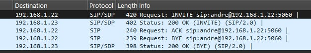
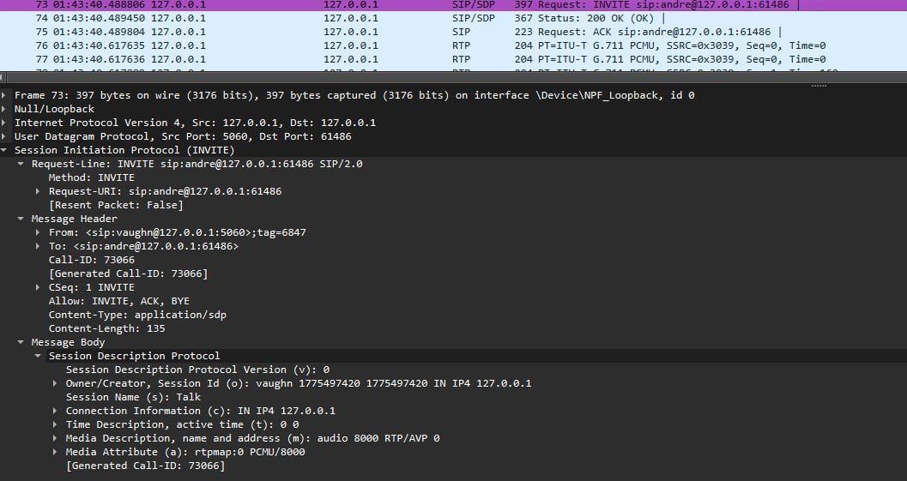
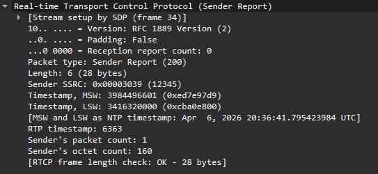

# NSCOM01 MCO2 - Implementation of Real-Time Audio Streaming over IP

## How to Run

1. Install Python and configure paths

- **Recommended:** Python 3.10 - 3.12
- **Note for Python 3.13+:** This project requires `audioop-lts` as the standard `audioop` library was deprecated in Python 3.13.

2. Install dependenies on the terminal **pip install sounddevice numpy audioop-lts**
3. Open two terminals
4. Start the program on both terminals

- Terminal 1: **python main.py 5060 8000**
- Terminal 2: **python main.py 5061 8002**

## Commands

- call <target_ip:port>: Initiates SIP handshake
- record <filename>: Records a .g711 file
- play <filename>: Play a saved .g711 file
- endcall: Sends a BYE message to terminate session

## Documentation

### SIP Signaling (RFC 3261)

Handshake: Full INVITE -> 200 OK -> ACK flow\
Mandatory Headers: Includes Via, From, To, Call-ID, and CSeq\
Teardown: Uses BYE to terminate sessions and close sockets

### SDP Negotiation (RFC 4566)

The SDP class generates the media block inside the INVITE. This gets parsed by the receiver to send RTP packets. The codec is locked to PCMU/8000 for VoIP compatibility.

### RTP & RTCP (RFC 3550)

RTP Packet: 12-byte header with Sequence Number, Timestamp, and SSRC\
Transmission: RTP packets sent every 20ms or 8000Hz\
RTCP Sender Report: Sends a periodic report every second

### Bonus

Real Time Microphone and Two-Way Communication using sounddevice library

## Test Cases and Sample Output

All of our sample output shows the fundamental reliability and protocol compliance of the implementation. The logs and captures confirm a successful three-way handshake, accurate media negotiation via SDP, and the continuous transmission of RTP audio frames supported by periodic RTCP status reports. This documentation serves as proof that the client operates as a standard-compliant VoIP agent.

1. SIP Handshake\
   
2. Wireshark Verification of SIP Signaling and SDP Negotiation\
   
3. RTCP Report\
   
